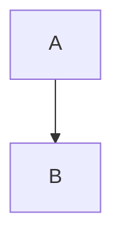

# Custom syntax

Add your own inline and block Markdown. A syntax is plain data; the parser, `stringify`, the renderer, the
WYSIWYG surface and the toolbar all read the same object, so it works in every place at once.

```ts
import { createEditor, defineInlineSyntax, defineBlockSyntax } from "advanced-texteditor-md";

const spoiler = defineInlineSyntax({ name: "spoiler", open: "||", tag: "span", className: "spoiler" });
const note = defineBlockSyntax({ name: "note", tag: "aside", className: "note" });

createEditor(el, { syntax: { inline: [spoiler], block: [note] } });
```

The same `syntax` object goes to `parse(md, { syntax })`, `stringify(doc, { syntax })` and
`renderHtml(md, { syntax })` outside the editor. A plugin can carry syntax too (`definePlugin({ name, syntax })`).
Both helpers are identity functions that only type the object.

## Inline: open and close

| Field | Meaning |
|---|---|
| `name` | unique id; also the command `custom:<name>` that toggles it |
| `open`, `close` | literal markers. `close` defaults to `open`, so `==x==` is `{ open: "==" }` |
| `tag` | output element, default `span`. One of `span mark u kbd sub sup small abbr div aside section details summary` |
| `className`, `attrs` | added to the element |
| `nested` | parse the inner text as inline Markdown. Default `true` |
| `toolbar` | `{ label, icon, shortcut, group }`: adds a toolbar button that wraps the selection in the markers |

Rules that keep text safe:

- When `open === close` the opener must be followed, and the closer preceded, by a non-space, and a run of the
  marker character must be exactly as long as the marker. So `===`, `====` and `a == b` stay text.
- The closer is searched skipping escapes and code spans. If it is not found, the syntax is switched off for the rest of the
  paragraph.
- Stringify escapes literal markers in ordinary text, so a text that contains `||` round-trips.

## Inline: pattern

For syntaxes that are not "marker text marker", give a regular expression. Group 1 is the inner text; **named groups
become `data`**, rendered as `data-<name>` attributes.

```ts
const tag = defineInlineSyntax({
  name: "tag",
  pattern: /#\{(?<id>[a-z0-9-]+)\|([^}]+)\}/y,   // #{id|label}
  tag: "span",
  className: "tag",
  nested: false,
  serialize: (inner, data) => `#{${data?.id}|${inner}}`,
});
```

A pattern cannot be inverted automatically, so give it a `serialize(inner, data)` that writes a node back to Markdown:

- `stringify` calls it for every pattern-only node (one with no `open`). `inner` is the node's children as inline Markdown
  text; `data` holds the named groups.
- Keys of `data` that start with `_` are internal (the matched source is kept in `_raw`) and are not passed to
  `serialize` and not rendered.
- If `serialize` throws, or you do not give one, the original matched source is written back unchanged. That is safe, but
  edits made inside the node (typing in the WYSIWYG surface) are lost on the next sync, so provide `serialize` for any pattern
  syntax you want to be editable.
- `inner` is the node's children written as Markdown when `nested` is not `false` (so `**bold**` inside survives), and the
  literal text when `nested: false`.
- `serialize` must produce text that the same pattern matches again. `stringify` re-parses its output until it stops
  changing, so a `serialize` that does not round-trip converges on whatever the parser makes of it.

## Block: containers

`::: name key=value key2="two words"` then content, then `:::`.

```md
::: note kind=warning
Careful: **this** is Markdown inside.
:::
```

| Field | Meaning |
|---|---|
| `name` | the word after the fence |
| `fence` | opener, default `:::` (`~~~~` and others work; the closer is the same string) |
| `tag`, `className`, `attrs` | output element |

The `key=value` pairs become `data-*` attributes. Nested openers of registered names are counted, so an inner `:::`
closes the inner block. An unclosed container is plain text.

## Output safety

Raw HTML is never produced from Markdown, and custom syntax cannot change that:

- Attribute names must match `/^[a-z][a-z0-9-]*$/` and may not start with `on`.
- `srcset` is dropped. A `style` value containing `url(`, `expression`, `javascript`, `@import`, `<` or `>` is dropped.
- URL-valued attributes (`href`, `src`, `action`, `formaction`, `poster`, `cite`, `data`, `background`, `ping`) go through the link
  policy.
- `tag` must be one of `span mark u kbd sub sup small abbr div aside section details summary`; anything else falls back to the
  default (`span` inline, `div` block). Block-level tags used by an inline syntax become `span`.

## Toolbar, shortcut and command

Give a syntax a `toolbar` and the editor adds a button that toggles it on the selection, using the command `custom:<name>`:

```ts
defineInlineSyntax({ name: "mark", open: "==", tag: "mark", toolbar: { label: "Highlight", shortcut: "Mod-Shift-h", group: "format" } });
editor.exec("custom:mark");
```

The Markdown pane implements the same command, so a button behaves the same in both modes.

## Testing a syntax

```ts
import { parse, stringify } from "advanced-texteditor-md";
const o = { syntax: { inline: [spoiler] } };
const once = stringify(parse("a ||b|| c", o), o);
console.assert(stringify(parse(once, o), o) === once);   // the fixed point
```

## Syntax added by the feature subpaths

What each feature subpath reads and writes. All of it is ordinary Markdown: a renderer that does not know a feature shows the text (or, for GitHub alerts, renders them itself).

<!-- feature:alerts -->
### GitHub alerts (`advanced-texteditor-md/alerts`)

```md
> [!NOTE]
> Useful information.
```

The marker `[!KIND]` must start a quote's first line and be alone on it (GitHub's rule); `KIND` is matched case-insensitively and written back upper-case. It is the inline pattern syntax `alertSyntax(names)` (a `custom` node named `alert`, data `{ kind }`) with `serialize`, so its brackets are never escaped. A blockquote whose first paragraph begins with it is the alert. Unknown kinds stay literal text (and are escaped on save, like any `[...]`). GitHub renders the same Markdown as an alert; other renderers show a quote that begins with `[!NOTE]`.

<!-- feature:code-blocks -->
### Code-block info strings (`advanced-texteditor-md/code-blocks`)

The core keeps everything after a fence's language as `codeBlock.meta` (verbatim; whitespace collapsed on save; a backtick in it makes the fence `~~~`). The code-blocks extension reads `title="x.ts"` / `title=x.ts` / `filename=`, `{1,3-5}`, `showLineNumbers[=N]` and `wrap`, and keeps every other token in order. A `{2}` written straight after the fence with no language is read as a range. Other renderers ignore the metadata (most use only the first word as the language).

<!-- feature:tables -->
### Tables (`advanced-texteditor-md/tables`)

No new syntax: tables stay GFM pipe tables. Two conventions only. A table whose header row is empty (`|  |  |` above the delimiter row) is a headerless table (the "header off" state); GitHub and other GFM viewers show it with an empty header row, plain CommonMark shows the pipe text. Imported and pasted values are backslash-escaped (`\|`, `\*`, `\<`, `\[`, `\$`, `\&`, ...) so they read literally everywhere. Column widths and sort order are never stored.


<!-- feature:diagrams -->
### Diagrams (fenced code, no new syntax)

The diagrams entry adds no syntax. A diagram is a plain fenced code block whose language the host registered a renderer for; the info string after the language is kept verbatim as the block's `meta` and read as `key="value"` pairs (`parseDiagramMeta`):

````md

````

`title` names the diagram region for assistive technology. Other keys are passed to the renderer as `ctx.meta`. Everything round-trips unchanged (`stringify(parse(x))`), and any other Markdown renderer shows the code.


<!-- feature:diff -->

<!-- feature:export -->

<!-- feature:chips -->
### Chips written by `advanced-texteditor-md/chips`

No new syntax: every chip the chips subpath writes is the core chip link, `[trigger+label](scheme:kind/id?k=v)`. Group
mentions are chips of kind `group` (`[@team](mention:group/team)`); the presets use the schemes `tag`
(`[#design](tag:design)`) and `channel` (`[\~general](channel:c1)`: the tilde is escaped because `~~` is strikethrough).
Text written straight into the Markdown pane (a typeahead pick, a picker pick, a tag created on space) escapes the label
exactly as `stringify` does: `\`, `[`, `]`, backtick, `*`, `~`, autolink-shaped `<`, entity-shaped `&`, `_` outside a word,
`|` in a table row, `$` when the line holds another dollar, `http://` / `www.`, the openers of custom inline syntaxes, and a
`!` right before the chip becomes `\!` so it is never an image. `stringify(parse(x)) === x` for that text.


<!-- feature:blocks -->
### Content blocks (`advanced-texteditor-md/blocks`)

- **Columns**: two registered block syntaxes, `columns` and `col` (`COLUMNS_SYNTAX`). Optional data on the opener: `n=<1-6>` and `widths="<1 to 6 numbers up to 12>"` (other keys are kept and ignored). Canonical form (what `stringify` writes; the second column is empty):

  ```md
  ::: columns
  ::: col
  Left
  :::

  ::: col
  :::
  :::
  ```

  Every `:::` closes the nearest open container, which is why both names must be registered (an unregistered `::: col` would not be counted).
- **Footnotes**: GFM's `[^label]` / `[^label]: text`, unchanged. Continuation paragraphs are indented four spaces.
- **Date chips**: a chip link with the scheme `date` and an ISO calendar date as its id: `[2026-10-02](date:2026-10-02)`. The text in brackets is the label (the ISO date unless the author wrote another).
- **File cards**: a plain link whose title is the file size: `[report.pdf](https://x/report.pdf "2.4 MB")`.
- **Galleries** and **rule styles** add no syntax (a paragraph of images; `---`).

<!-- feature:writing -->

<!-- feature:i18n -->

